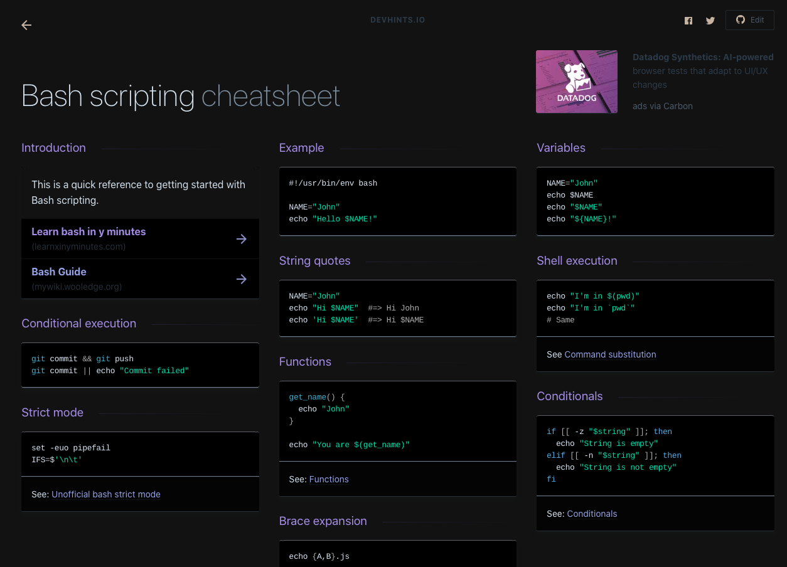
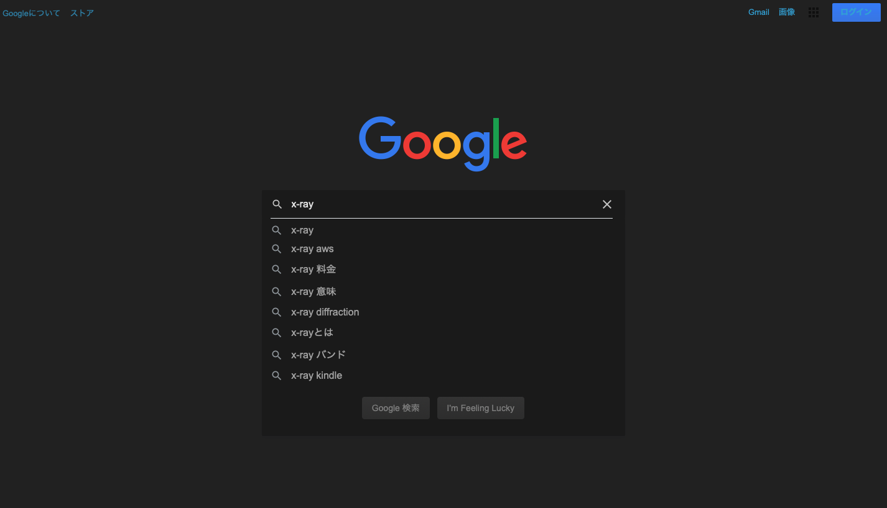
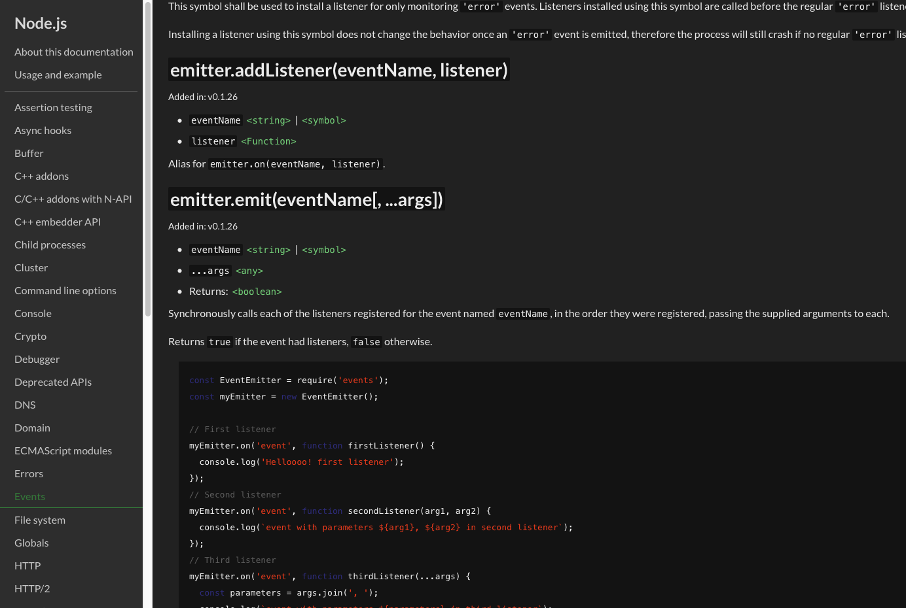
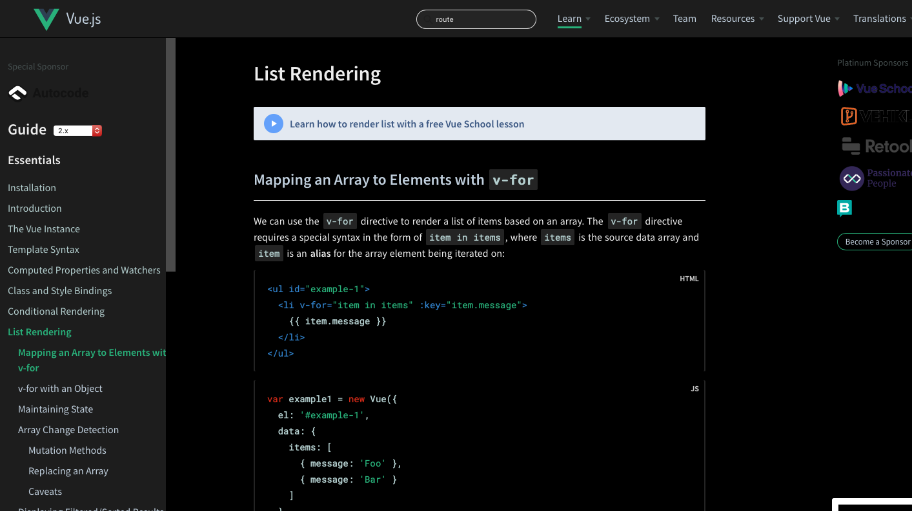

# Dark userstyles
This is a collection of my dark userstyles.

- [Dark userstyles](#dark-userstyles)
    - [Usage](#usage)
    - [Main themes](#main-themes)
        - [Devhints](#devhints)
        - [Google Search](#google-search)
        - [Laravel Docs](#laravel-docs)
        - [Node.js API Docs](#nodejs-api-docs)
        - [Docs for Vue.js, Vuex, Vue CLI or Vue SSR](#docs-for-vuejs-vuex-vue-cli-or-vue-ssr)
        - [WordPress Dashboard](#wordpress-dashboard)
        - [other trivial styles](#other-trivial-styles)
    - [Bug report and requests](#bug-report-and-requests)
    - [Contribution](#contribution)
        - [Notes:](#notes)
    - [License](#license)

## Usage
Install [Stylus](https://add0n.com/stylus.html) for either Firefox, Chrome or Opera then install any styles by clicking on them below. Once installed, the themes will update automatically, according to your Stylus settings.

## Main themes
### Devhints
📦 [Install this style](https://github.com/xentok/userstyles/raw/main/build/devhints.io/dark.user.css)

### Google Search
📦 [Install this style](https://github.com/xentok/userstyles/raw/main/build/google.com/clean-dark.user.css)

### Laravel Docs
📦 [Install this style](https://github.com/xentok/userstyles/raw/main/build/laravel.com/dark.user.css)

### Node.js API Docs
📦 [Install this style](https://github.com/xentok/userstyles/raw/main/build/nodejs.org/dark.user.css)

### Docs for Vue.js, Vuex, Vue CLI or Vue SSR
📦 [Install this style](https://github.com/xentok/userstyles/raw/main/build/vuejs.org/dark.user.css)

* TODO: fix search preview and alert color

### WordPress Dashboard
📦 [Install this style](https://github.com/xentok/userstyles/raw/main/build/wordpress/black.user.css)

### other trivial styles
* [Qiita](https://github.com/xentok/userstyles/raw/main/build/qiita.com/dark.user.css)
* [linux manpage](https://github.com/xentok/userstyles/raw/main/build/linux.die.net/dark.user.css)

## Bug report and requests
I'm welcome to issues including feature requests.
If you're reporting an issue with a current style, screenshots and URLs are helpful.

## Contribution
1. Fork this repository.
2. Install node.js and yarn if you haven't.
3. Run `$ yarn` in Terminal
4. Edit some style (in the `sass/` directory).
5. Commit, push the branch and make a pull request.

### Notes:
* Your commit messages need to meet conventional commit format. See [here](https://github.com/conventional-changelog/commitlint#what-is-commitlint).
    * conventional commit format: `type(scope?): subject`
    * `(scope)` needs to be directory names under `sass/`. e.g. `fix(google.com): fix some white color`

## License
[Under MIT license](https://opensource.org/licenses/MIT).